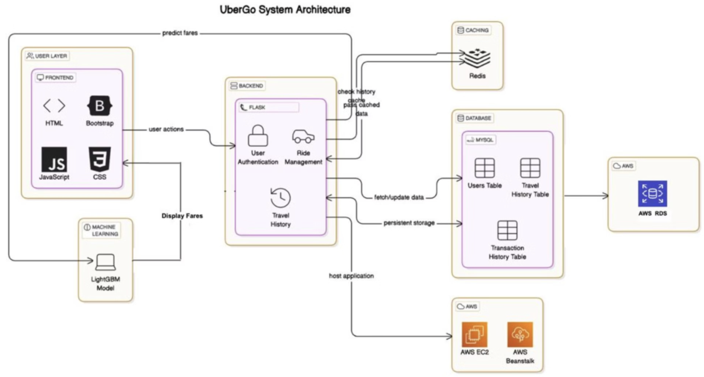

# 🚕 Uber Transport Simulation.

A **scalable** and **high-performance** ride-hailing platform designed to handle **real-time ride requests, dynamic pricing, and efficient ride allocation**. The system leverages **event-driven processing**, **machine learning**, and **cloud-based deployment** to ensure seamless operation.

### 🌐 **Live Deployment (AWS)**
**Public IP:** `3.129.95.65`  
- [Driver Login](http://3.129.95.65/driver/login.html)
- [User Login](http://3.129.95.65/user/login.html)
- [Admin Login](http://3.129.95.65/admin/login.html)

---



## 📌 **Key Features**
✔️ **Real-Time Ride Matching** – Assigns drivers dynamically based on user requests.  
✔️ **Dynamic Pricing Model** – **LightGBM-based** fare calculation reduces pricing errors by **25%**.  
✔️ **High Performance** – Supports **10,000+ concurrent users** with **Redis caching & Kafka event-driven processing**.  
✔️ **Scalability & Cloud Deployment** – Hosted on **AWS EC2 & Elastic Beanstalk** with **99.9% uptime**.  
✔️ **Performance Optimization** – Redis speeds up session retrieval by **40%**, improving user experience.  
✔️ **Secure & Reliable** – Built with **JWT authentication, API security**, and **Dockerized microservices**.  

---

## 🏗️ **Tech Stack**

| Category                  | Technologies Used |
|---------------------------|------------------|
| **Backend**               | Flask (RESTful APIs), Django |
| **Frontend**              | React.js, HTML, CSS, JavaScript |
| **Database**              | MySQL |
| **Caching**               | Redis |
| **Machine Learning**      | LightGBM (Dynamic Pricing) |
| **Performance Testing**   | Apache JMeter |
| **Geospatial Visualization** | Mapbox API |
| **Containerization & Orchestration** | Docker, Kubernetes |
| **Event-Driven Processing** | Kafka |
| **Cloud Deployment**       | AWS (EC2, RDS, Elastic Beanstalk) |

---

## 🔥 **System Architecture**
1️⃣ **User requests a ride** → Handled by the **Flask backend**.  
2️⃣ **Ride assigned dynamically** → Uses **geolocation & demand-based pricing**.  
3️⃣ **LightGBM pricing model** → Optimized **dynamic fare calculation**.  
4️⃣ **Real-time updates via Kafka** → **Driver assignment & ride status** handled asynchronously.  
5️⃣ **Optimized Performance** → **Redis caching** accelerates database queries by **35%**.  
6️⃣ **Deployed on AWS** → Ensures **99.9% uptime** with **auto-scaling**.  

---

## 🚀 **Installation & Setup**
### **Prerequisites**
Ensure you have the following installed:
- **Python 3.x**
- **Node.js & npm**
- **Docker & Kubernetes**
- **Kafka & Redis**
- **AWS CLI** (For cloud deployment)

### **🔧 Steps to Run Locally**
```bash
# Clone the repository
git clone https://github.com/bindalkush/Uber-Transport-Simulation.git
cd Uber-Transport-Simulation

# Backend Setup
cd backend
pip install -r requirements.txt
python app.py  # Starts the Flask API

# Frontend Setup
cd ../frontend
npm install
npm start  # Starts the React frontend

# Start Kafka & Redis
docker-compose up -d  # Runs Kafka and Redis in containers
```

---

## 📊 **Performance Results**
📈 **Tested with 10,000+ concurrent users** via **Apache JMeter**.  
⚡ **35% faster** database queries using **Redis caching**.  
📉 **25% pricing error reduction** with **LightGBM-based fare optimization**.  
🔄 **99.9% uptime** with **AWS auto-scaling**.  

---

## 📑 **API Documentation**
🔹 The project uses **Postman** for API documentation & testing.  
🔹 Swagger documentation can be accessed (if hosted) for API reference.  

---

## 🤝 **Contributing**
We welcome contributions! To contribute:  
1. Fork the repository.  
2. Create a feature branch (`git checkout -b feature-name`).  
3. Commit changes (`git commit -m "Added new feature"`).  
4. Push to your branch (`git push origin feature-name`).  
5. Submit a pull request (PR).  

---

## 📜 **License**
This project is licensed under the **MIT License**.

---

## 📞 **Contact**
👨‍💻 **Developed by:** [Kush Bindal](https://github.com/bindalkush)  
📧 Email: [kushbindal2000@gmail.com](mailto:kushbindal2000@gmail.com)  
🔗 Portfolio: [bindalkush.github.io/kushbindal](https://bindalkush.github.io/kushbindal/)  
